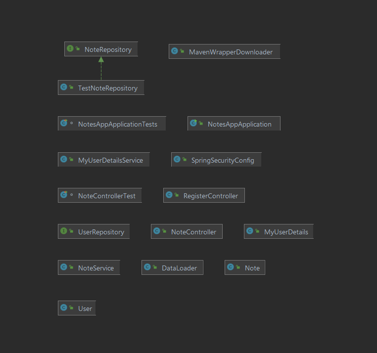
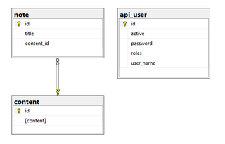

Stos technologiczny projektu:
Java, Spring, Angular

Diagram klas:

Diagram bazy danych:

REST API:

NoteController:

1. Get mapping  "<host>/api/notes/" - Pobierz wszystkie notatki.
2. Get mapping  "<host>/api/notes/{aId}" - Pobierz notatkę o zadanym numerze id.
3. Post mapping "<host>/api/notes/addNote" - Dodaj nową notatkę.
4. Put mapping "<host>/api/notes/editNote" - Edytuj notatkę.
5. Delete mapping "<host>/api/notes/deleteNote" - Usuń notatkę o zadanym numerze id.

RegisterController:
1. Post mapping "<host>/register" - Dodaj nowego użytkownika.
