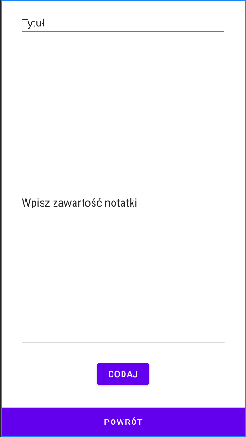
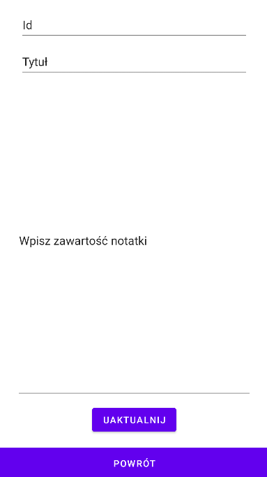
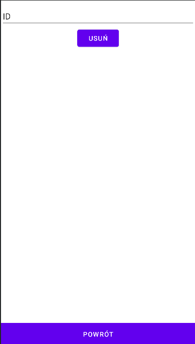
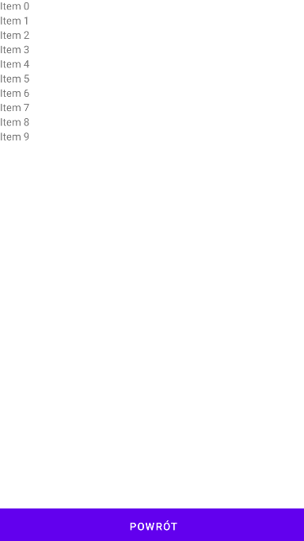

Wymagania funkcjonalne:
1. Dodawanie notatki
2. Edycja notatki
3. Usuwanie notatki
4. Odczyt wszystkich notatek
5. Odczyt ostatnio dodanej notatki

Wymagania niefunkcjonalne:
1. Wykorzystanie architektury REST API
2. Umożliwienie łatwej zmiany, rozszerzenia technologii wykorzystywanych w części klienckiej aplikacji.

Odbiorcy:
osoby, które mają potrzebę częstego zapisywania rzeczy do zapamiętnia
użytkownicy, którzy chcą współdzielić notatki z innymi użytkownikami

Korzyści:
Możliwość zapisu i odczytu notatek z różnych urządzeń
Brak konieczności noszenia ze sobą papierowego notatnika, dostęp z telefonu, który zawsze mamy ze sobą.

Wymagania GUI:

- Ekran główny

- Ekran dodawania notatki

- Ekran edycji notatki

- Ekran ekran usuwania notatki

- Ekran wyświetlania notatki

